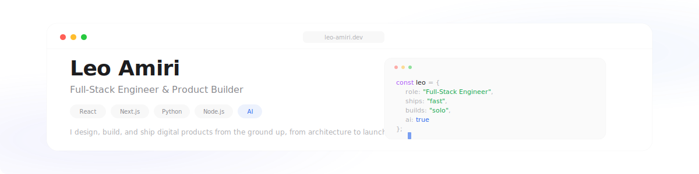
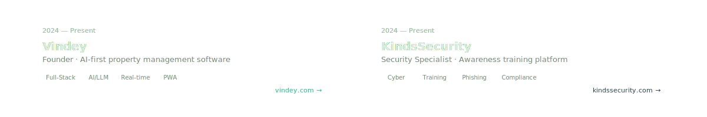

<!-- Header Banner — macOS window -->

 

 

<!-- Currently Working -->

 

<b>Previously</b>

 
<table>
<tr>
<td width="50%">

**Product Lead @ [Lightwork AI](https://lightwork.co)**
 
Led product from seed stage. Rapid prototyping workflows that helped close a $3M round.

</td>
<td width="50%">

**Product Engineer @ [Fireworks](https://fireworks.date)**
 
Dating & friendship matchmaking app. Full-stack mobile development with AI-driven matching.

</td>
</tr>
</table>

 

## Tech Stack

**Frontend**

**Backend**

**AI & LLM**

**DevOps**

**Mobile & Real-time**

**Design & Tools**

 

  

